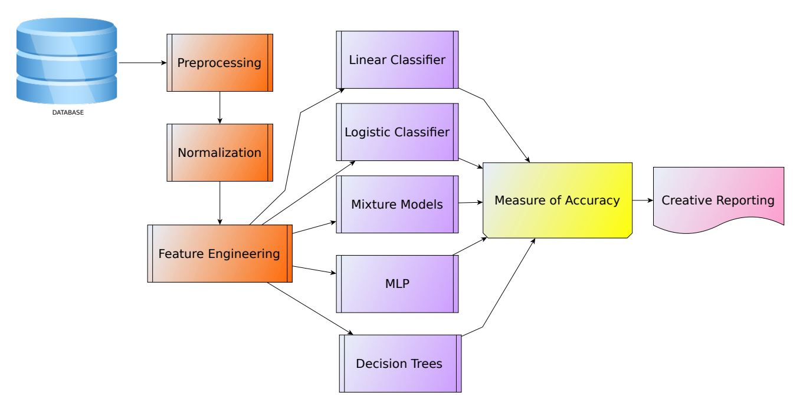
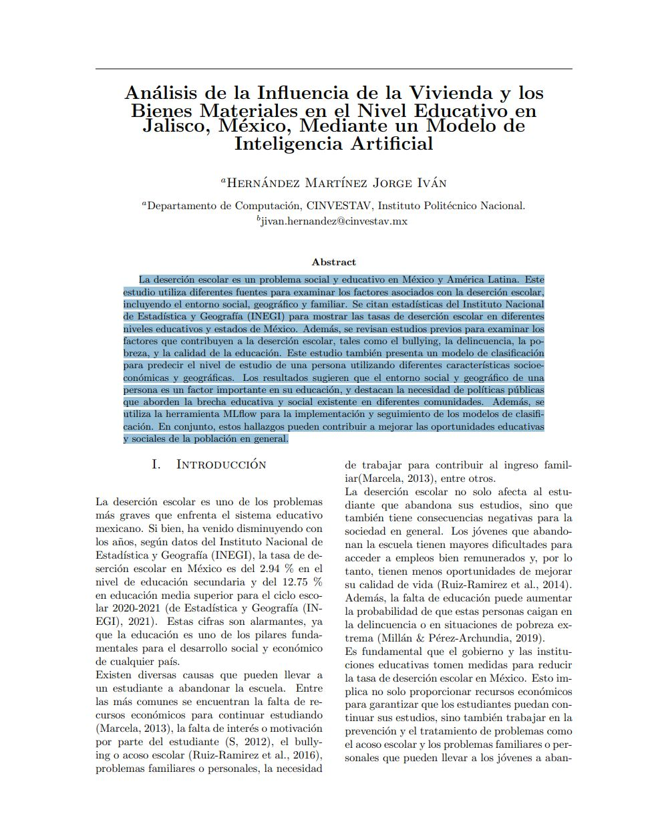
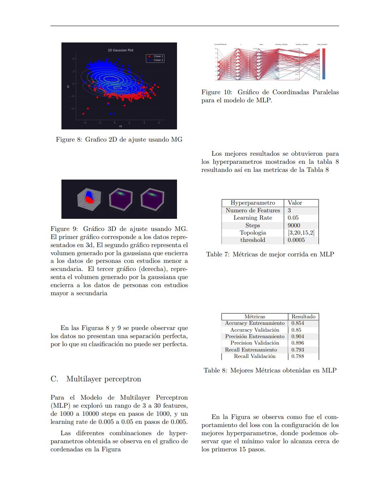
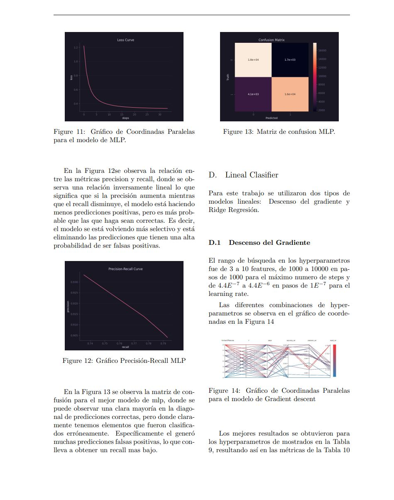
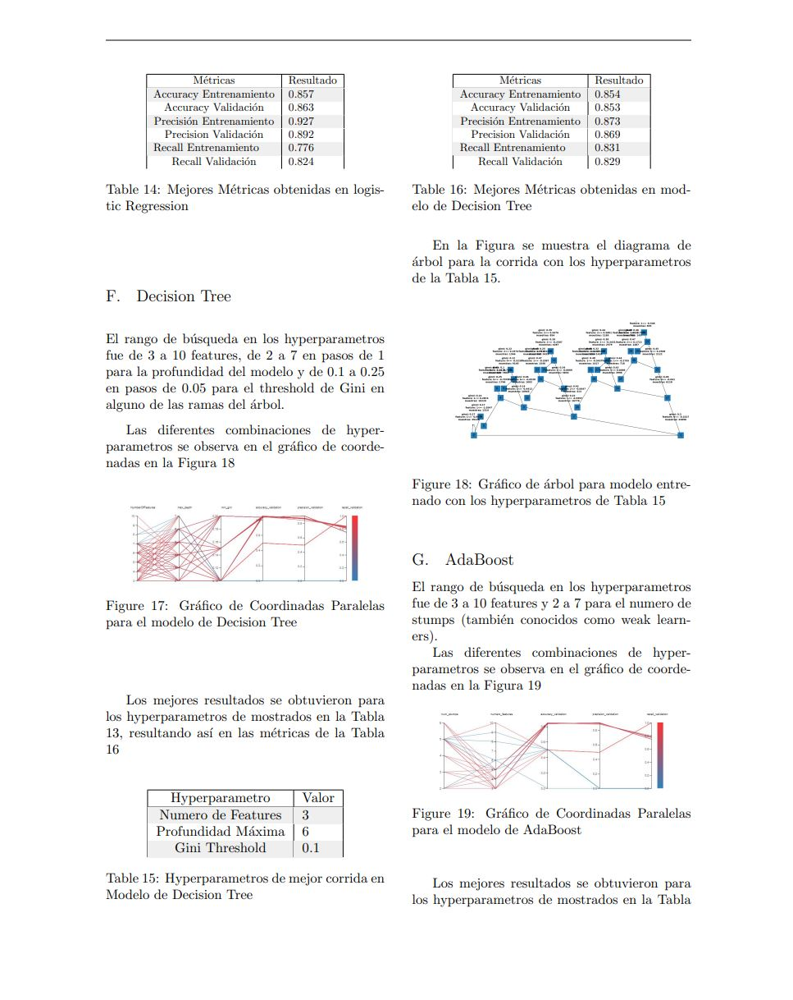

# Análisis de la Influencia de la Vivienda y los Bienes Materiales en el Nivel Educativo en Jalisco, México, Mediante un Modelo de Inteligencia Artificial

## Resumen
La deserción escolar es un problema social y educativo en México y América Latina. Este estudio utiliza diferentes fuentes para examinar los factores asociados con la deserción escolar, incluyendo el entorno social, geográfico y familiar. Se citan estadísticas del Instituto Nacional de Estadística y Geografía (INEGI) para mostrar las tasas de deserción escolar en diferentes niveles educativos y estados de México. Además, se revisan estudios previos para examinar los factores que contribuyen a la deserción escolar, tales como el bullying, la delincuencia, la pobreza y la calidad de la educación. Este estudio también presenta un modelo de clasificación para predecir el nivel de estudio de una persona utilizando diferentes características socioeconómicas y geográficas. Los resultados sugieren que el entorno social y geográfico de una persona es un factor importante en su educación, y destacan la necesidad de políticas públicas que aborden la brecha educativa y social existente en diferentes comunidades. Además, se utiliza la herramienta MLflow para la implementación y seguimiento de los modelos de clasificación. En conjunto, estos hallazgos pueden contribuir a mejorar las oportunidades educativas y sociales de la población en general.

## Pipeline del Proyecto
A continuación se muestra el pipeline utilizado en el proyecto:

## Descarga del Articulo completo
Puedes descargar el informe completo en formato PDF [aquí](Proyecto_final\FinalReport\paper.pdf).

---
